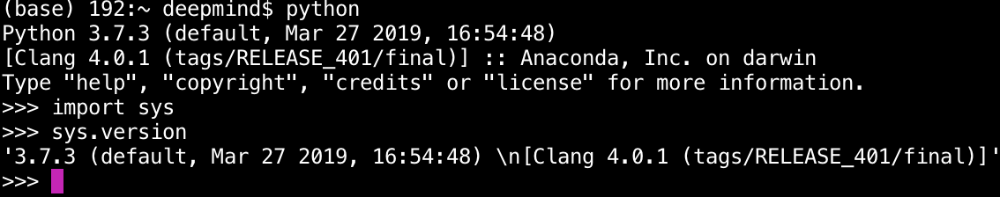
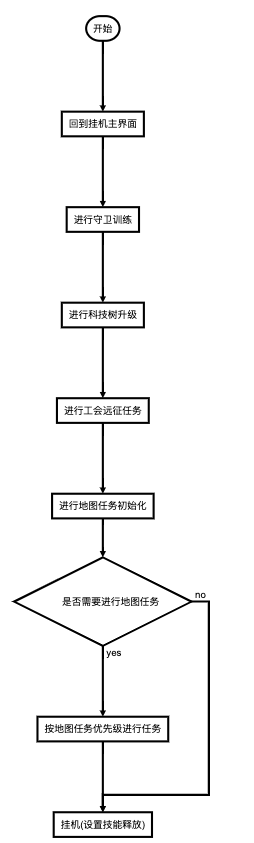

这个脚本是用来进行steam 挂机游戏firestone的自动化处理。  

可以自动进行**公会远征**、**地图任务**、**守卫训练**、**科技树升级**、**转生爬楼**等功能。  

解放双手，超护肝脚本。  
**请到[oneTaken/firestone](https://github.com/oneTaken/firestone)获取最新脚本.**

# 1. 如何使用  
在配置好电脑的python环境以及下载完脚本之后：  
步骤1：打开firestone游戏并全屏,并在科技树中移动屏幕到想自动升级的位置  
步骤2：打开终端并进入脚本所在目录  
步骤3：运行脚本`python main.py`  
步骤4：切换到firestone游戏所在全屏，运行脚本之后会有3s的缓冲时间来切换到 游戏所在全屏  
步骤5：退出脚本运行  
+ 退出方法：切换到脚本运行的终端，同时按下按键`ctrl`与按键`c`  


##### 1.1 游戏版本
当前firestone 游戏版本:  4.1.1  
##### 1.2 电脑环境
当前代码在Macbook Pro 13-inch下的笔记本上测试通过。
windows下当然也可以使用，直接游戏全屏即可。  

##### 1.3 脚本功能
当前代码的默认逻辑为: 
+ 科技树III
+ 守卫训练时训练小火龙

#### 1.4 运行代码
脚本是使用的python来进行编写的，需要电脑上有python的环境。
##### 1.4.1 如何判断电脑上是否有python环境
一般电脑都会默认自带python的环境，在mac或者windows下打开终端，输入
```
python
```
如何没有错误，进入了python的交互环境，说明是包含的。
```
import sys
sys.version
```
需要出来的python版本在python3.6以上，也就是>=3.6，python的版本越新，数字编号越大。
一个示例如下所示，这里的示例为3.7.3，是在3.6以上的。

##### 1.4.2 安装python环境
这里我就放一篇blog来参考了，就不从头写了。  
[Anaconda在windows/mac下的安装与环境配置](https://blog.csdn.net/qq_37392932/article/details/81210470)
选择最新版本的Anaconda安装完了以后依据1.4.1来进行测试即可。
##### 1.4.3 运行脚本
先安装需要的python的包的依赖。
在当前文件下打开命令行，输入以下代码：
```
pip install opencv-python
pip install pyautogui
pip install numpy
pip install scikit-image
```
安装完了之后，下载这个项目的整个压缩包。
打开终端，解压之后进入到脚本所在目录，直接运行脚本即可。

```python3
python main.py
```

# 2. 代码流程图

```flow
st=>start: 开始
exit=>operation: 回到挂机主界面
guard=>operation: 进行守卫训练
tree=>operation: 进行科技树升级
family=>operation: 进行工会远征任务
map_init=>operation: 进行地图任务初始化
map_check=>condition: 是否需要进行地图任务
map_run=>operation: 按地图任务优先级进行任务
guaji=>operation: 挂机(设置技能释放)
e=>end

st->exit->guard->tree->family->map_init->map_check
map_check(yes)->map_run
map_check(no)->guaji
map_run->guaji
```


github markdown不支持流程图, 这里直接截个图。


# 4. To Do Lists

- [ ] 跨平台测试运行
- [ ] 炼金房自动进行
- [ ] 公会远征逻辑优化
- [ ] 科技树升级自动化判断
- [ ] 图形用户界面简化操作流程
- [ ] windows下后台运行脚本

# 5. FQA
1. 有没有一个**特别简单好上手**的图形化界面，只需要勾选功能操作的就可以了？
   **答**：图形化用户界面正在制作过程中，需要等一段时间。代码逻辑和现在的脚本是一样的，如果不急着使用，可以等图形化用户界面出来。
1.  **终端/命令行**是什么东西？
   **答**：参见[Windows怎么打开电脑终端](https://zhidao.baidu.com/question/460695290502887245.html)
1. 这个脚本在**windows**电脑下能使用吗？
   **答**：使用的脚本是用python来编写的，在windows或者mac的电脑环境下都是可以运行的，只需要python3.6以上的编程环境即可使用。
1. 使用脚本的时候需要自己写代码嘛？
   **答**：不需要自己写，有什么需求可以直接提个issue就可以了。
   [如何使用github里面的issues](https://jingyan.baidu.com/article/e52e36159a50a701c70c5173.html)
1. 使用这个会**封号**吗？
   **答**：不会。这个脚本只是模拟人为的点击，解放双手来挂机，不存在任何的修改游戏内容的行为。
1. 如何自定义首领英雄的**技能释放**顺序？
   **答**：目前是默认释放男法的技能3，用来清怪。如果有其他的需求需要自己修改一下，或者等待图形化界面出来以后的简单操作。
1. 如何自定义想升级的**科技树**中的某个科技？
    **答**：为了简化并且保持通用性，每一个等级的科技树都可以分为两个部分，左半部分与右半部分。

# 6. Release Notes

# 7. Contribution
如何觉得这个游戏脚本使用起来有问题，可以开一个issue来描述。

如何觉得代码逻辑可以优化，欢迎提PR来优化。

如何觉得这个项目对你有帮助，请点个star. 
